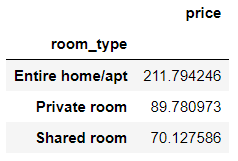

# NY-AirBnB

## Resources and Links
Kaggle dataset: https://www.kaggle.com/dgomonov/new-york-city-airbnb-open-data?select=AB_NYC_2019.csv 

## Overview
The aim of this project was to build a predictive model for the price of AirBnB listings in New York. The prediction will be made based on a dataset available on kaggle.  
The data set includes ~50,000 entries with various parameters for each listing which are summarised below.

Data Series Name | Data Type| Description
--- | --- | ---
id                             |  int64  | Unique id for the listing
name                           |  object | Description of the listing
host_id                        |  int64  | Unique id for the host of the listing
host_name                      |  object | -
neighbourhood_group            |  object | Borough
neighbourhood                  |  object | -
latitude                       |  float64| -
longitude                      |  float64| -
room_type                      |  object | Private room, Entire home/apt, Shared room
price                          |  int64  | $/night
minimum_nights                 |  int64  | Minimum length of booking
number_of_reviews              |  int64  | -
last_review                    |  object | Date of the most recent review
reviews_per_month              |  float64| -
calculated_host_listings_count |  int64  | No. of listings by each host
availability_365               |  int64  | No. of nights listing is available per year

The data series id, name, host_id, host_name and last_review were omitted for the modelling.

## Exploratory Analysis Highlights
 

> **A correlation heatmap. Look at the correlation with price for the most important information for this example.**

## Model performances

Three models were tried for making the prediction: a linear regression, a lasso regression and a random forest. The mean absolute error (MAE) was used as the assessment metric as it gave the clearest indication of how far away the prediction was. Please see the Models notebook for more details of the models.

The linear regression performed poorly, most likely due to the sparse nature of the one-hot encoded categorical variables. The model failed to yield an appropriate value for the MAE. The lasso regression was tried as it deals well with the type of input features in this dataset. It performed far better than the linear regression, giving an MAE of $67.64 on the test data.

The random forest regressor was tried next, which after some tuning gave an MAE of $64.29. However, this error is most likely being skewed by some very highly priced listings that all the models are struggling to predict (as found in the EPA histogram of price). Removing all listings that are $300 or greater should help make more accurate predictions for the majority of rooms.

~3000 listings were removed and a new random forest regression was done on the new data (the same hyperparameters were used to save some time on tuning). The MAE on the new test data was $30.81, more than twice as good as the initial prediction. This model would be more useful for >90% of listings. 

